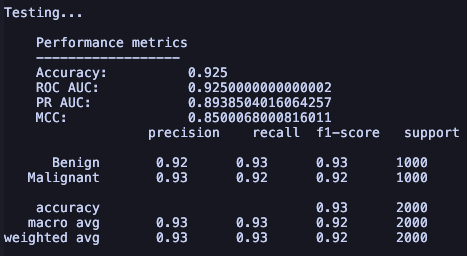

# Skin cancer classification using SVMs

## Overview

## Usage

### Dependencies

First, install dependencies using your preferred package manager.

Here are two examples using [uv](https://docs.astral.sh/uv/) (my preferred
Python project package manager) and pip.

```bash
# Using uv.
uv init; uv add -r requirements.txt

# Using pip.
pip install -r requirements.txt
```

### Data

To access the source data, run `extract_dash.sh` from the command line to unzip
and move the data to `data/`. There should be two directories for the
training and testing sets, each image should follow the format
`{tumor type}_{number}.jpg`. It should look like this:

```output
data/
  | - train/
  |     | - Benign_1.jpg
  :     :   :
  | - test/
  |     | - Benign_1.jpg
  :     :   :
```

### Running the model

To train or make predictions out of the box, you just need to call `svc.py`. It
will process the data, use the models, and analyze skin cancer classification
performance.

```bash
# With uv.
uv run svc.py

# With pip/conda/others.
python svc.py
```

You can change the parameters when `main()` is called to adjust the behavior.

```python
# svc.py

### main() PARAMETERS
# run_train [default: True]: enable training run
# run_test [default: True]: enable testing run
# save_model [default: False]: save models from training run for later use
# load_model [default: True]: load pre-saved model for testing run

### EXAMPLES
# To use the pre-saved models for predictions
run_train = False

# To use models passed directly from training (i.e., don't use pre-saved models)
load_models = False
```

### Some notes on the data

The data is mostly balanced between benign and malignant tumors with a class
distribution of 53:47, respectively, for the training set and a class
distribution of 1:1, respectively, for the test set.

Overall, there are 11,879 images in the training set and 2,000 in the test set.
All images are 224 x 224 pixels and in full color. See below for an example of
the training data.

|  |
| -- |
| <center>Example images from the training set. Note the difference in lighting, obstructions (hair and viewport), clarity, markings (top row, second to left), zoom, object distances, *etc.*</center> |

The tumor's color is one of the many indicators medical professionals use to
determine a tumor's type.

|  |
| -- |
| <center>Comparison of histograms of the individual RGB channels and the grayscale image between a benign and malignant tumor. The solid line indicates the histogram while the dashed line indicates the cumulative distribution function of the histrogram. </center> |

Unfortunately, it is not a perfect descriptor for predicting if a tumor is
malignant. Characteristics of the distributions (their
[moments](https://en.wikipedia.org/wiki/Moment_(mathematics))) show no strong
correlation with the tumor status target value (represented by the top row and
left column).

|  |
| -- |
| <center>Linear correlation heatmap between color-channel based features. The mean, variance, skewness, and kurtosis of each color channel of each image is calculated. The labeled rows and columns are the mean and skewness for each color. The second row is the mean of the red channel histogram and the fourth column is the kurtosis of the red channel histogram, and so on for each color.</center> |

## Results

|  |
| -- |
| <center>Confusion matrix from trained SVM predictions made on the test set (2,000 images). A perfect predictor would be 1.0's on the diagonal and 0.0's on the off-diagonal elements.</center> |

||
| -- |
| <center>ROC and PRC from test set predictions. Area under the curve (AUC) quantifies the performance of the predictor in regards to the ROC and the PRC. 0.5 indicates a model that is as good as random guessing, 0.0 a perfectly wrong predictor, and 1.0 a perfectly correct predictor.</center> |

|  |
| -- |
| <center>Summary of performance metrics using the test set. Accuracy is simply the ratio of correct predictions to total predictions. ROC AUC and PRC AUC have already been explained. The Matthews Correlation Coefficient (MCC) is similar to the F1 score but accounts for any class imbalance(s) (there was some in the training set but not in the test set).</center> |
